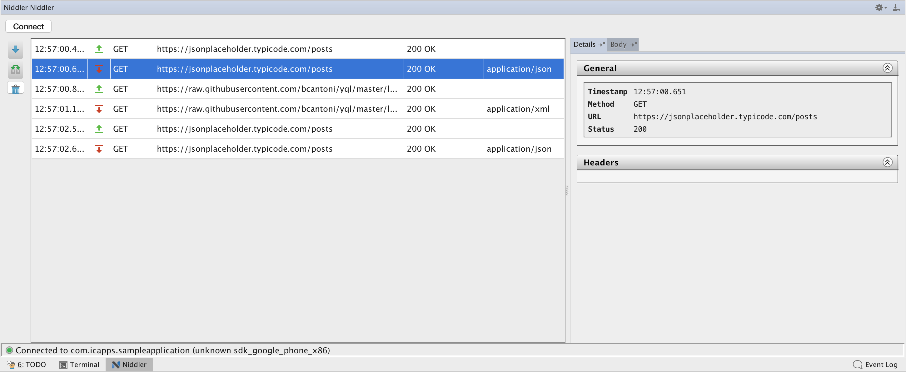

# Niddler-ui

[Niddler](https://github.com/icapps/niddler) is a network debugging utility for Android apps that caches network requests/responses, and exposes them over a websocket. It comes with a simple interceptor for Square's OkHttpClient, as well as a No-op interceptor for use in release scenario's.

Niddler-UI is the UI component that communicates with Niddler over a websocket. It comes as a standalone Swing application, as well as an Android Studio / IntelliJ plugin.

To install Niddler-UI into Android Studio / IntelliJ, go to Preferences > Plugins and search for niddler 
